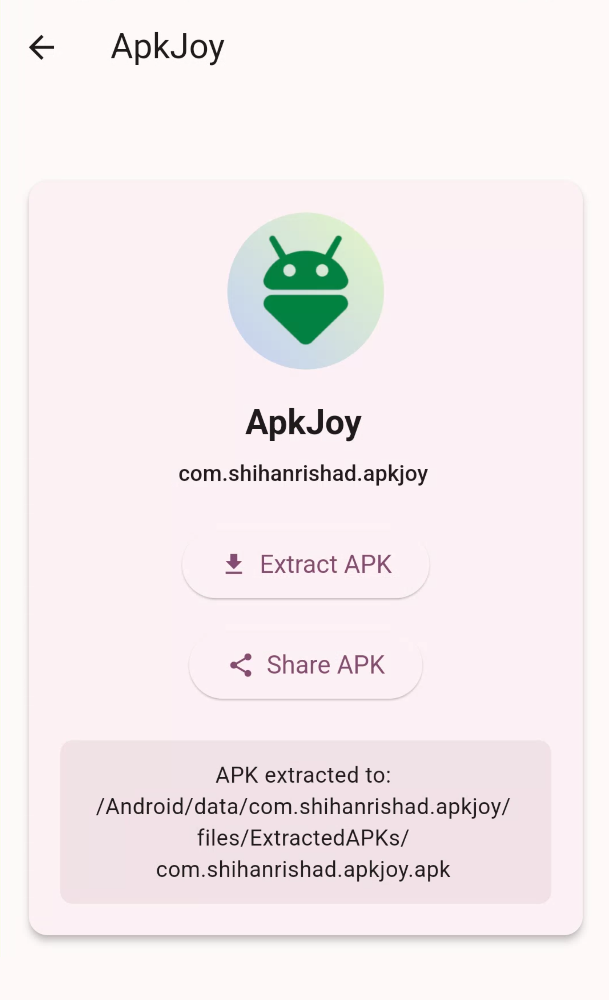
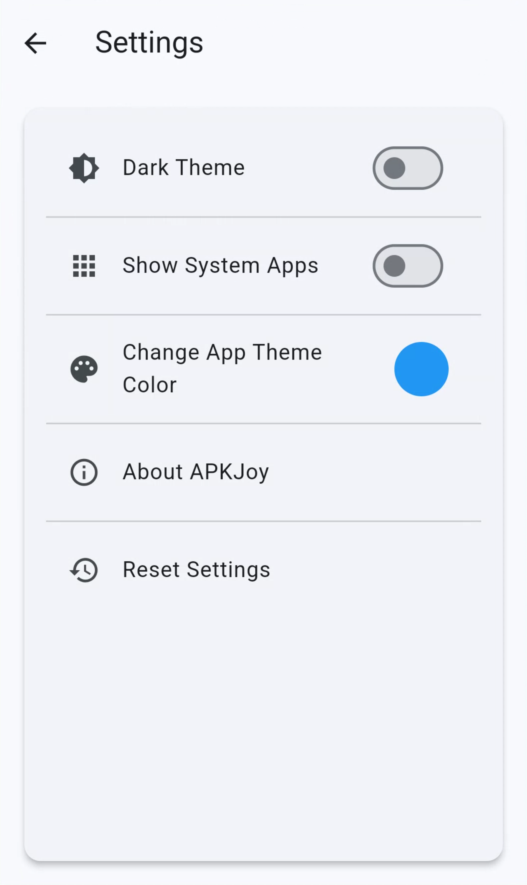

<h1 align="center"> Apkjoy - Extract, Save & Share APKs Instantly 🚀 </h1>

<strong>Your friend for apps on you pone.</strong>

 Extract, save, and share your installed apps with just one tap. Designed for speed, security, and simplicity, Apkjoy is your go-to solution for managing APK files like a pro.

## Features

🔘 **Simple Extraction** – Extract APKs instantly from installed apps, on one tap.

🔘 **Save to External Storage** – APKs are stored in `Android/data/com.your.package.name`.

🔘 **Lightweight & Efficient** – No unnecessary bloat, runs smoothly.

🔘 **Secure & Private** – No hidden trackers or unnecessary permissions.  

🔘 **Modern UI** – Simple, sleek, and intuitive.  

🔘 **Completely Free** – No ads, no subscriptions, just APK extraction. 

## Installation

1. **Download Apkjoy from the Releases section** or directly from the link below:
2. Install it on your device.  
3. Start extracting APKs instantly!  
<h4>
Direct download: <a href="https://github.com/ShihanRishad/ApkJoy/releases/tag/v1.0.0">https://github.com/ShihanRishad/ApkJoy/releases/tag/v1.0.0</a>
</h4>

## Screenshots

<table align="center">
<tr>
<th>Home</th><th>Detail</th><th>Settings</th>
</tr>
<tr>
<td></td>
<td></td>
<td></td>
</tr>
</table>

## Tech Stack

- **Flutter** – Cross-platform performance.  
- **Dart** – Optimized for speed.  
- **Kotlin (Android Native)** – Ensures seamless APK extraction.  

## How To Use

1. Open Apkjoy.
2. Select an installed app.
3. Click "Extract APK" – APK saved instantly!
4. Find the extracted APK in `Android/data/com.your.package.name`.
5. Share the APK with ease!

## Supported Platform

📌 **Android Only** – This app is designed exclusively for Android devices.

<!-- ## Permissions Used

- **Storage Access**

 -->

## Why Choose Apkjoy?

🔹 **Fast & Lightweight** – Minimal footprint, maximum efficiency.  

🔹 **No Ads, No Subscriptions** – 100% free forever.  

🔹 **User-Friendly** – Simple interface, no complex steps.  

## Contribute

Contributions welcome! Feel free to fork, submit pull requests, or report issues.  

1. Fork the repo.
2. Clone the repo: 
`git clone https://github.com/your-fork-url/ApkJoy.git`

3. Create your feature branch:
`git checkout -b feature-branch`

4. Commit your changes (`git commit -m 'Add some feature'`).

5. Push to the branch (`git push origin feature-branch`).
6. Open a Pull Request.

## License

This project is licensed under the **MIT License**
